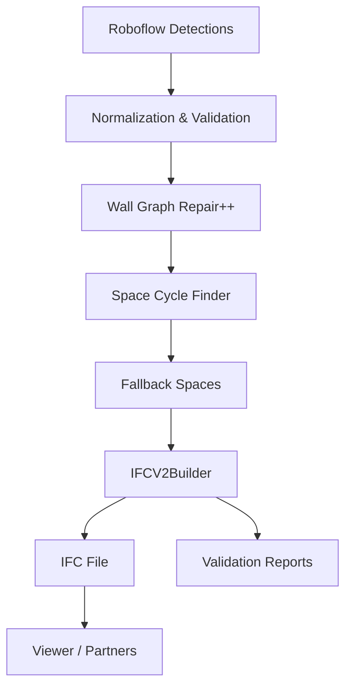

# Bimify IFC Export Platform – Architecture Overview

_Last updated: 2025-11-16_

## 1. Executive Summary

Bimify’s IFC Export Platform converts noisy 2D floorplan detections into production-grade IFC 4.3 models. The system delivers deterministic geometry, resilient fallbacks, and investor-ready scalability. This document describes the technical architecture for stakeholders, new team members, and partners.

Key capabilities:

- Robust IFC generation even on low-quality inputs (scans, hand sketches, partial plans).
- Deterministic wall/space/slab reconstruction via graph-based topology.
- Automatic recovery from missing or degenerate detections ("never abort").
- Clean integration boundaries for ML inference, API services, and downstream BIM tools.

## 2. High-Level System Overview

The platform is organized into five logical layers:

1. **Input Acquisition** – receives Roboflow detections (JSON) and metadata (scale, storey height).  
2. **Normalization & Validation** – converts pixels to millimeters, validates structure, and filters noise.  
3. **Geometric Reconstruction Pipeline** – applies simplification, graph repair, space cycle detection, and fallbacks.  
4. **IFC Construction Layer** – builds the IFC graph (IfcWallStandardCase, IfcSpace, IfcSlab, openings, materials).  
5. **Export & Reporting** – writes IFC files, generates validation artifacts, and updates metrics.

 <!-- replace with actual asset -->

## 3. Core Components

| Layer | Module | Responsibility |
|-------|--------|----------------|
| Normalization | `core/ml/postprocess_floorplan.py` | Converts detections to `NormalizedDet`, enforces class semantics, ensures geometric validity. |
| Validation | `core/validate/input_validation.py` + `core/validate/prediction_validator.py` | Confidence/geometry thresholds, stats, detection filtering. |
| Geometry Contract | `core/geometry/contract.py` | Single source of truth for tolerances (snap distance, min lengths, fallback thicknesses). |
| Wall Processing | `core/reconstruct/walls.py` | Simplifies polygons, collapses nodes, resolves T-junctions, merges overlapping walls. |
| Space Extraction | `core/reconstruct/spaces_graph.py` | Planar graph traversal and deterministic space cycle detection (face-based). |
| Fallback Generation | `core/validate/fallback_generation.py` | Ensures minimum walls/spaces exist (perimeter walls + central space). |
| IFC Builder | `core/ifc/build_ifc43_model_v2.py` | Creates IFC project/storey/walls/slabs/spaces/openings/materials, enforces axes. |
| Orchestration | `services/api/ifc_exporter_v2.py` | Glue code for full pipeline, configuration, metrics, and export scheduling. |
| Visualization | `ui/components/IfcJsViewerClient.tsx` | Web assembly viewer with readiness/backoff logic. |

## 4. Geometry Processing Pipeline

### 4.1 Normalization & Pre-Validation

1. **Detection normalization:** Convert pixel coordinates to millimeters, repair polygons (`NormalizedDet`).  
2. **Input validation:** Minimum confidence, point-count, and geometry corrections (buffer(0) fix).  
3. **Geometry contract:** All downstream modules reference `contract.py` constants.

### 4.2 Wall Graph Repair++

- **Simplification:** Douglas-Peucker (class-aware tolerance) and grid snapping.  
- **Node collapse:** Merge wall endpoints within 8 mm.  
- **T-Junction resolver:** Insert connector points where walls meet mid-segment.  
- **Overlap merge:** Remove duplicate/parallel walls to prevent double geometry.

### 4.3 Deterministic Space Cycle Finder

- Extract wall edges, quantize to grid, build planar graph (DCEL).  
- Traverse faces to identify closed loops (rooms).  
- Validate cycles (area, dimension, containment).  
- Assign holes (columns, shafts) to parent rooms.  
- Produce sorted, deduplicated `SpacePoly` list.

### 4.4 Fallbacks & Safety Nets

- **Two-pass heuristics:** Legacy polygonization used when graph method yields no rooms.  
- **Validation fallback:** Perimeter walls + central space ensure "never abort" guarantee.  
- **Slab fallback:** Outer floor slab generated from wall union even without external flags.

## 5. IFC Construction Layer

Implemented in `IFCV2Builder`:

1. **Project scaffold:** Create IfcProject, IfcSite, IfcBuilding, IfcBuildingStorey.  
2. **Walls:** For each `WallProfile` generate IfcWallStandardCase with axis (longest rectangle edge), material sets, quantities.  
3. **Spaces:** Convert `SpacePoly` to IfcSpace with coverings and property sets.  
4. **Slabs:** Outer floor using union/buffer pipeline (CW orientation, micro-simplify).  
5. **Openings:** Doors/windows snapped to longest wall edge, minimum depth enforcement, void relations.  
6. **Validation hooks:** Pre- and post-export checks, logging, metrics.

## 6. Resilience & Fail-Safe Mechanisms

- **Never-Abort Guarantee:** If no walls/rooms remain, fallback synthetics guarantee IFC validity.  
- **Contract Enforcement:** Every tolerance references `contract.py` – ensures consistent tuning.  
- **Error Handling:** Exceptions logged via Loguru; pipeline continues with previous stage output.  
- **Viewer Readiness:** WASM backoff prevents `GetLineIDsWithType` errors; warnings downgraded to debug.  
- **Axis Fallback:** Minimal axis representation created when data is incomplete.

## 7. Data Flow & Deployment

Deployment highlights:

- **Backend:** Python service (FastAPI) with shared ProcessPoolExecutor for IFC builds.  
- **Storage:** IFC files persisted in object storage; metadata in relational DB.  
- **Monitoring:** Metrics via `core.metrics.pipeline_metrics`.  
- **CI/CD:** Unit tests (geometry + regression) + end-to-end export tests executed before release.

## 8. Configuration & Extensibility

- `PipelineConfig` controls tolerances, feature flags, and fidelity tiers.  
- Geometry contract enabling consistent tuning across modules.  
- Future extensions: additional room semantics, HVAC placements, BIM integrations.

## 9. Testing & Quality Assurance

- **Unit tests:** Polygon repair, graph traversal, space validation, slope coverage.  
- **Integration tests:** Wall repair + cycle finder + builder.  
- **E2E tests:** Run on worst-case inputs (gaps, duplicates, hand-drawn).  
- **Performance benchmarks:** Large plans to ensure sub-second graph traversal.

## 10. Roadmap & Partnerships

Immediate next steps:

- Expand room classification (e.g., assign IfcSpace type from ML labels).  
- Integrate metadata pipelines for energy simulation partners.  
- Enhance viewer with dynamic filtering and progress overlays.  

Partnership integrations:

- **AEC Firms:** Provide deterministic IFC for BIM workflows.  
- **Software Vendors:** Embed pipeline via API or on-prem container.  
- **Investors:** Clear resilience story; pipeline runs at scale with deterministic outputs.

## 11. Contact

- **Architecture Lead:** [lead@bimify.ai](mailto:lead@bimify.ai)  
- **Investor Relations:** [investors@bimify.ai](mailto:investors@bimify.ai)  
- **Technical Support:** [support@bimify.ai](mailto:support@bimify.ai)
